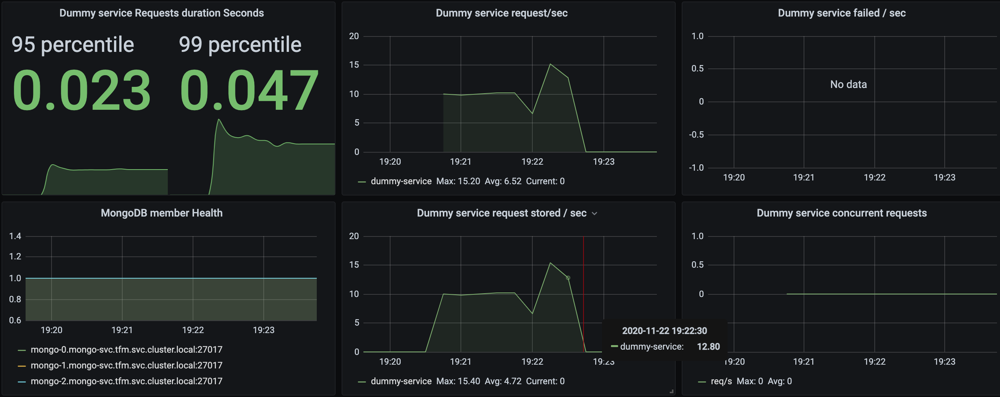
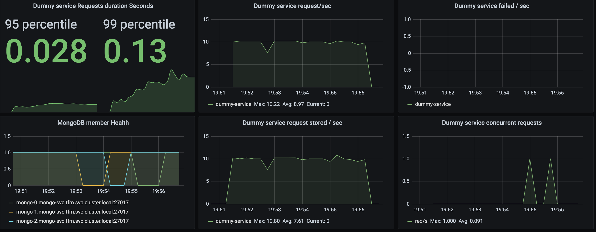
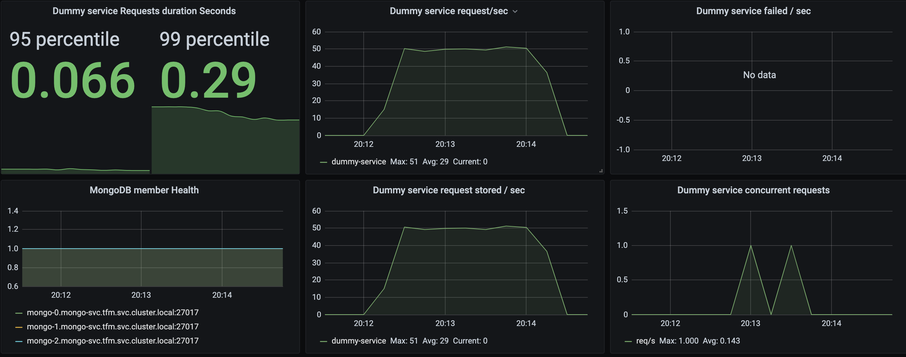
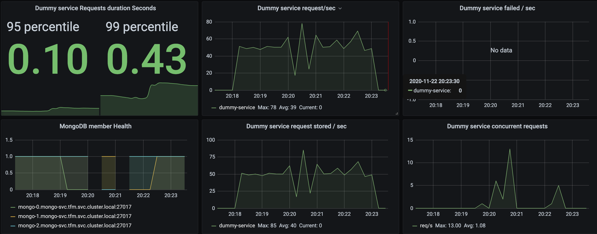
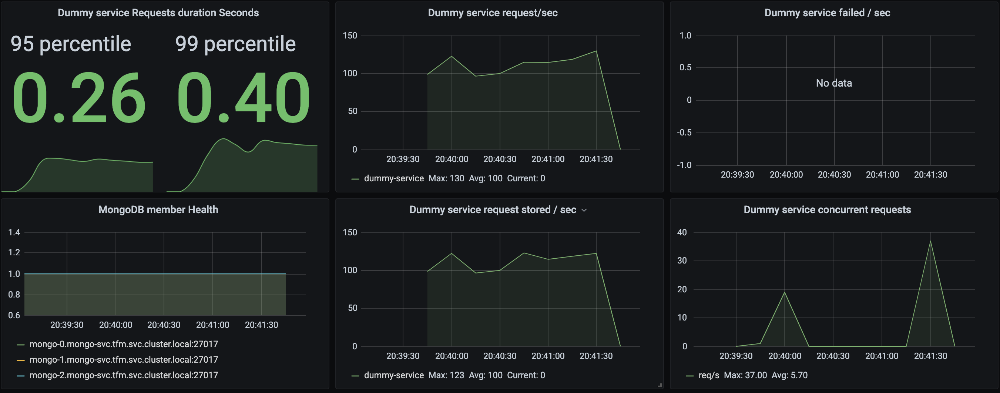
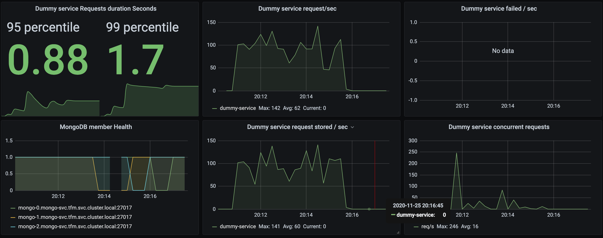

# Despliegue de MongoDB con operador

Un operador en Kubernetes es como un controlador de los que ofrece Kubernetes de forma nativa pero para aplicaciones personalizadas. Con los operadores se pueden ejecutar tareas de forma automática que permitan o faciliten la operación de una determianda aplicación como puede ser el caso de realizar copias de seguridad, subir o bajar versiones, escalar el número de réplicas o crear un cluster que necesite unos pasos concretos para la correcta inicialización.

Los operadores básicamente son aplicaciones programadas para ejecutar determinadas acciones dados unos eventos produciodos por Kubernetes.
Lo operadores son empaquetados en contenedores y ejecutados dentro del cluster de Kubernetes de la misma forma que cualquier otra aplicación.

Normalmente los operadores utilizar el API de Kubernetes para escuchar determiandos eventos como pueden ser la creación o actualización de alguno de los recursos como *Deployments* o *ConfigMaps* entre otros.

Estos operadores se crean con los **Custom Resource Definitions** (CRDs) que, como su nombre indica, son recursos personalizados con los que se puede extender el API de Kubernetes más allá de los proporcionados por defecto como los *Pods* o *StatefulSets*.

## MongoDB Kubernetes Operator

Para el despliegue de una base de datos MongoDB en Kubernetes, MongoDB ofrece una versión *community* y una versión *enterprise* del operador para Kubernetes.

Para las pruebas usaremos la versión *community* que la podemos encontrar en [Github](https://github.com/mongodb/mongodb-kubernetes-operator).

Este operador nos permitirá crear un cluster de Mongo en modo replicación de una forma sencilla creando un objeto del tipo *MongoDB*.

El operador, internamente, se encargará de crear un objeto *StatefulSet* y algunos *ConfigMaps* que contendrán información relativa al cluster que se desplegará.

Los *Pods* creados por el operador contienen dos contenedores. Uno es el propio servicio `mongod` que ejecuta el motor de la base de datos y el otro contenedor es el [**Agente de MongoDB**](https://docs.opsmanager.mongodb.com/current/tutorial/nav/mongodb-agent/) que se podrá encargar de tareas de automatización, backups o monitorización.

Con este agente y la colaboración del operador de k8s conseguiremos configurar, escalar y actualizar el cluster de MongoDB de una forma fiable.

### Instalación del operador

Comenzamos creando el CRD en el cluster de Kubernetes que nos permitirá extender el API de K8s con objetos *MongoDB*.

Aplicamos el fichero [mongodb.com_mongodb_crd.yaml](cdr/mongodb.com_mongodb_crd.yaml) descargado del repositorio del operador.

```bash
kubectl apply -f cdr/mongodb.com_mongodb_crd.yaml
```

Después aplicamos los ficheros contenidos en la carpeta [operator](operator) que también hemos descargado del repositorio del operador.

Este directorio contiene las definiciones de los recursos que el operador necesita para ejecutarse tales como *Roles*, *ServiceAccounts* y el propio *Deployment* que describe el *Pod* del operador.

```bash
kubectl apply -f operator/
```

Al finalizar, listamos los recursos para verificar que se han creado los objetos correctamente.

```bash
$ Kubectl get deployment,roles,rolebinding,sa

NAME                                             READY   UP-TO-DATE   AVAILABLE   AGE
deployment.apps/mongodb-kubernetes-operator      1/1     1            1           26d


NAME                                                         CREATED AT
role.rbac.authorization.k8s.io/mongodb-kubernetes-operator   2020-10-17T16:09:25Z

NAME                                                                ROLE                               AGE
rolebinding.rbac.authorization.k8s.io/mongodb-kubernetes-operator   Role/mongodb-kubernetes-operator   26d

NAME                                         SECRETS   AGE
serviceaccount/default                       1         26d
serviceaccount/mongodb-kubernetes-operator   1         26d
```

Tras tener instalado el operador, ya podemos crear el objeto *MongoDB* con nuestra base de datos replicada que tenemos en el fichero [mongodb_replicaset.yaml](mongodb_replicaset.yaml).

En el fichero podemos ver como indicamos que es un recurso personalizado en `kind: MongoDB` y que queremos un tipo *Replicaset* en `spec.type` y el número de miembros que queremos en el cluster en `spec.members`.

En la descripción también le indicamos el usuario, la contraseña y los roles con los que queremos que se inicialice la base de datos así como algunos parámetros personalizados que queremos incluir en el template del *StatefulSet* que será creado por el operador.

Fichero completo:
```yaml
---
apiVersion: mongodb.com/v1
kind: MongoDB
metadata:
  name: mongo
spec:
  members: 3
  type: ReplicaSet
  version: "4.2.6"
  featureCompatibilityVersion: "4.2"
  security:
    authentication:
      modes: ["SCRAM"]
  users:
    - name: my-user
      db: admin
      passwordSecretRef: # a reference to the secret that will be used to generate the user's password
        name: my-user-password
      roles:
        - name: clusterAdmin
          db: admin
        - name: userAdminAnyDatabase
          db: admin
        - name: readWriteAnyDatabase
          db: admin
  statefulSet:
      spec:
        template:
          spec:
            containers:
              - name: "mongodb-agent"
                resources:
                  requests:
                    cpu: 100m
                    memory: 200M
              - name: "mongod"
                resources:
                  requests:
                    cpu: 100m
                    memory: 200M

# the user credentials will be generated from this secret
# once the credentials are generated, this secret is no longer required
---
apiVersion: v1
kind: Secret
metadata:
  name: my-user-password
type: Opaque
stringData:
  password: test
```

Aplicamos el fichero de descripción:

```bash
kubectl apply -f mongodb_replicaset.yaml
```

Tendremos como resultado:

```bash
$ kubectl get mongodb,pods,statefulset,secrets,pvc,pv

NAME                        PHASE   VERSION
mongodb.mongodb.com/mongo

NAME                                                  READY   STATUS    RESTARTS   AGE
pod/mongo-0                                           2/2     Running   0          86s
pod/mongo-1                                           2/2     Running   0          49s
pod/mongo-2                                           1/2     Running   0          15s
pod/mongodb-kubernetes-operator-7557797594-mpj6h      1/1     Running   3          10d

NAME                     READY   AGE
statefulset.apps/mongo   2/3     87s

NAME                                             TYPE                                  DATA   AGE
secret/mongo-agent-scram-credentials             Opaque                                2      26d
secret/mongo-config                              Opaque                                1      26d
secret/mongo-my-user-scram-credentials           Opaque                                6      26d
secret/mongodb-kubernetes-operator-token-g29mz   kubernetes.io/service-account-token   3      26d
secret/my-user-password                          Opaque                                1      86s

NAME                                        STATUS   VOLUME                                     CAPACITY   ACCESS MODES   STORAGECLASS   AGE
persistentvolumeclaim/data-volume-mongo-0   Bound    pvc-ad054fb1-cfa8-43d5-900b-2def04437386   10G        RWO            local-path     87s
persistentvolumeclaim/data-volume-mongo-1   Bound    pvc-61aae1d1-a672-47ab-b549-3288d7a731e1   10G        RWO            local-path     50s
persistentvolumeclaim/data-volume-mongo-2   Bound    pvc-bc10b366-7037-4dd1-8a64-932c8c2880f4   10G        RWO            local-path     16s

NAME                                                        CAPACITY   ACCESS MODES   RECLAIM POLICY   STATUS   CLAIM                     STORAGECLASS   REASON   AGE
persistentvolume/pvc-61aae1d1-a672-47ab-b549-3288d7a731e1   10G        RWO            Delete           Bound    tfm/data-volume-mongo-1   local-path              47s
persistentvolume/pvc-ad054fb1-cfa8-43d5-900b-2def04437386   10G        RWO            Delete           Bound    tfm/data-volume-mongo-0   local-path              83s
persistentvolume/pvc-bc10b366-7037-4dd1-8a64-932c8c2880f4   10G        RWO            Delete           Bound    tfm/data-volume-mongo-2   local-path              13s
```

## Funcionamiento del operador

Con los datos del objeto *MongoDB*, el operador crea un *Secret* con la configuración que el agente de Mongo necesita para operar.

```bash
kubectl get secret mongo-config -o "jsonpath={.data.cluster-config\.json}" | base64 -d | jq --color-output
```

Obtenemos un fichero extenso con la descripción de los miembros del cluster entre muchos otros parámetros.

```json
{
  "version": 7,
  "processes": [
  {
    "name": "mongo-0",
    "hostname": "mongo-0.mongo-svc.tfm.svc.cluster.local",
    "args2_6": {
      "net": {
        "port": 27017
      },
      "replication": {
        "replSetName": "mongo"
      },
      "storage": {
        "dbPath": "/data"
      }
    },
    "featureCompatibilityVersion": "4.2",
    "processType": "mongod",
    "version": "4.2.6",
    "authSchemaVersion": 5,
    "systemLog": {
      "destination": "file",
      "path": "/var/log/mongodb-mms-automation/mongodb.log"
    },
    "wiredTiger": {
      "engineConfig": {
        "cacheSizeGB": 0
      }
    }
  }

...

"replicaSets": [
    {
      "_id": "mongo",
      "members": [
        {
          "_id": 0,
          "host": "mongo-0",
          "priority": 1,
          "arbiterOnly": false,
          "votes": 1
        },
        {
          "_id": 1,
          "host": "mongo-1",
          "priority": 1,
          "arbiterOnly": false,
          "votes": 1
        },
        {
          "_id": 2,
          "host": "mongo-2",
          "priority": 1,
          "arbiterOnly": false,
          "votes": 1
        }
      ],
      "protocolVersion": "1"
    }
  ],

...
```

En cada cambio que apliquemos en el objeto *MongoDB*, el operador modificará este fichero que automaticamente será leido por el agente.

Para el proceso de cambio de versión, el agente usa la función de automatización para manejar eficientemente el proceso de actualizaciones continuas.

El operador configura el StatefulSet para bloquear a Kubernetes (establece a `OnDelete`) de realizar el RollingUpdate nativo porque el proceso nativo puede ocasionar multiples reelecciones en el cluster de MongoDB.

Podemos leer más detalles sobre el proceso del operador en el documento de [arquitectura](https://github.com/mongodb/mongodb-kubernetes-operator/blob/master/docs/architecture.md#example-mongodb-version-upgrade).

El uso del Agente de Mongo para el proceso de actulización aporta múltiples ventajas al proceso. Entre ellas:

- Actualizar los secundarios primero.
- Esperar a los secundarios para lanzar una reelección.
- Asegurar que la réplica está siempre disponible durante todo el proceso de actualización.

## Pruebas de actualización contínua

Tras ejecutar el proceso de actualización simulando diferentes cargas de trabajo en `dummy-service` estos son los resultados:

**Muestra base 10 reqs/sec durante 2 minutos:**

```
Summary report @ 19:22:32(+0100) 2020-11-22
  Scenarios launched:  1200
  Scenarios completed: 1200
  Requests completed:  1200
  Mean response/sec: 9.93
  Response time (msec):
    min: 528.7
    max: 11253.5
    median: 764
    p95: 3031.7
    p99: 4686.2
  Scenario counts:
    0: 1200 (100%)
  Codes:
    200: 1200
```



**Actualización Mongo 10 reqs/sec durante 5 minutos:**

```
All virtual users finished
Summary report @ 19:56:15(+0100) 2020-11-22
  Scenarios launched:  3000
  Scenarios completed: 3000
  Requests completed:  3000
  Mean response/sec: 9.97
  Response time (msec):
    min: 514.3
    max: 4900.9
    median: 602.5
    p95: 1188.6
    p99: 2290.4
  Scenario counts:
    0: 3000 (100%)
  Codes:
    200: 3000
```



Observamos en la gráfica `MongoDB member Health` como el proceso de actualización no comienza por el último ordinal sino por el nodo `mongo-1` que es el primer nodo secundario. En esta prueba, el nodo primario es `mongo-0`, que es el último en ser actualizado.

En esta prueba, durante el proceso de actualización, los tiempos de respuesta y duración de la petición no se han visto afectactados significativamente así como tampoco se han acumulado peticiones concurrentes a la espera de ser almacenadas.

En este primer caso, observamos como el trabajo del operador de MongoDB junto con el *agente* hacen que la transición entre una versión y otra de mongo ocurra de forma suave y sin afectar al rendimiento de la aplicación.

**Muestra base 50 reqs/sec durante 2 minutos:**

```
Summary report @ 20:14:11(+0100) 2020-11-22
  Scenarios launched:  6000
  Scenarios completed: 6000
  Requests completed:  6000
  Mean response/sec: 49.4
  Response time (msec):
    min: 526.6
    max: 4443.1
    median: 669.4
    p95: 1703.9
    p99: 2277.5
  Scenario counts:
    0: 6000 (100%)
  Codes:
    200: 5998
    502: 2
```



**Actualización Mongo 50 reqs/sec durante 5 minutos:**

```
Summary report @ 20:23:01(+0100) 2020-11-22
  Scenarios launched:  15000
  Scenarios completed: 15000
  Requests completed:  15000
  Mean response/sec: 49.84
  Response time (msec):
    min: 525.8
    max: 11730.5
    median: 860.9
    p95: 4366.9
    p99: 9024.3
  Scenario counts:
    0: 15000 (100%)
  Codes:
    200: 14994
    502: 6
```



En este caso, el nodo primario es `mongo-1`, por tanto, la actualización comienza por el nodo `mongo-0` que es el primer nodo secundario en esta prueba.

**Muestra base 100 reqs/sec durante 2 minutos:**

```
Summary report @ 20:41:29(+0100) 2020-11-22
  Scenarios launched:  12000
  Scenarios completed: 12000
  Requests completed:  12000
  Mean response/sec: 97.16
  Response time (msec):
    min: 554.3
    max: 28686.3
    median: 2844.9
    p95: 5937.7
    p99: 7645.6
  Scenario counts:
    0: 12000 (100%)
  Codes:
    200: 11994
    502: 6
```

```
All virtual users finished
Summary report @ 20:07:58(+0100) 2020-11-25
  Scenarios launched:  12000
  Scenarios completed: 11998
  Requests completed:  11998
  Mean response/sec: 83.88
  Response time (msec):
    min: 591.5
    max: 60224.6
    median: 4417.2
    p95: 9485.3
    p99: 15009.4
  Scenario counts:
    0: 12000 (100%)
  Codes:
    200: 11982
    502: 16
  Errors:
    ECONNRESET: 2
```



**Actualización Mongo 100 reqs/sec durante 5minutos:**

En esta prueba donde se fuerza al servidor al límite observamos como los tiempos de respuesta y de duración de la petición se disparan considerablemente comparado con las pruebas anteriores.

En la gráfica `Dummy service request/sec` podemos ver como hay caidas en el número de peticiones que indican que las peticiones enviadas por el software de pruebas no consiguen alcanzar el Pod del servicio, ya que estas son rechazadas por el ingress debido a la falta de recursos del sistema

Aun con los recursos del servidor usados al máximo, no se observan pérdidas de datos de las peticiones que consiguen llegar al servicio.

```
All virtual users finished
Summary report @ 20:16:04(+0100) 2020-11-25
  Scenarios launched:  30000
  Scenarios completed: 27346
  Requests completed:  27346
  Mean response/sec: 94.31
  Response time (msec):
    min: 569.9
    max: 74614.9
    median: 6439.9
    p95: 19318.8
    p99: 25248.7
  Scenario counts:
    0: 30000 (100%)
  Codes:
    200: 27150
    502: 196
  Errors:
    ECONNRESET: 202
    ECONNREFUSED: 2452
```



## Conclusiones

Las pruebas nos indican que, bajo una carga de trabajo aceptable para los recursos del cluster, el operador es capaz de proporcionar un proceso de actualización muy suave y sin apenas degradación del servicio.

Además de la fiabilidad que aporta, el resto de características que aporta el operador, como la autoconfiguración, backup, scale-up y scale-down, lo hacen tremendamente útil para operar MongoDB en un cluster Kubernetes

En conclusión, el operador de MongoDB para Kubernetes aporta una muy buena fiabilidad y resiliencia al proceso de actualización de la base de datos.
