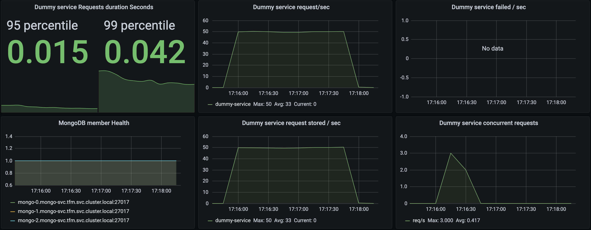

# Despliegue de MongoDB con StatefulSet

En este apartado crearemos un cluster de MongoDB en modo replicación usando el recurso **StatefulSet** de Kubernetes.

**StatefulSet** es un controlador de Kubernetes específico para apliaciones con estado que se encarga de crear réplicas de *Pods* de una forma ordenada y de asignar una identidad única y permanente a cada Pod que se matiene tras los reinicios.

## Creando un StatefulSet de MongoDB

Crar un recurso *StatefulSet* no es muy diferente de crear un *Deployment*. En este caso, empezamos definiendo un *Headless Service* ya que para esta aplicación con estado no es necesario proveer de balanceo de carga a las instancias, dejando que sea el servicio de DNS únicamente que resuelva las IPs de los Pods según su propia estrategia.

```yaml
apiVersion: v1
kind: Service
metadata:
  name: mongo-svc
  labels:
    app: mongo
spec:
  ports:
  - port: 27017
    name: mongo
  clusterIP: None // 'None' es lo que hace del servicio un servicio headless
  selector:
    app: mongo

```

El siguiente paso es crear la especificación de *StatefulSet* definida en el fichero [mongo-statefulset.yaml](mongo-statefulset.yaml).

Una configuración que se debe tener en cuenta en el StatefulSet es que debemos definirle a qué *Service* está asociado declarando el atributo `spec.serviceName` al nombre del servicio que, en nuestro caso, es `mongo-svc`.

Crearemos un cluster de 3 réplicas para observar el comportamiento del StatefulSet durante el proceso de creación y actualización de los servicios de Mongo.

## Configurando la replicación de MongoDB

Un cluster *replica set* de Mongo requiere de una configuración específica que debe ser provisionada en tiempo de instalación. En esta configuración se debe especificar que se está creando un cluster *replicaset* y hay que proveer concretamente qué nodos van a formar parte del cluster.

Se obta por la opción de crear un *Job* de inicialización del cluster que ejecutará unos comando de Mongo para inicializar el cluster.

Este es el detalle del script que inicializa el replicaset de Mongo.

```js
    rs.initiate({ _id: "mongo", version: 1, members: [
      { _id: 0, host: "mongo-0.mongo-svc.tfm.svc.cluster.local:27017" },
      { _id: 1, host: "mongo-1.mongo-svc.tfm.svc.cluster.local:27017" },
      { _id: 2, host: "mongo-2.mongo-svc.tfm.svc.cluster.local:27017" }
     ] });
     rs.status();
    sleep(2000);
    db.createUser( { user: "my-user",
              pwd: "test",
              roles: [ { role: "clusterAdmin", db: "admin" },
                      { role: "readAnyDatabase", db: "admin" },
                      { role: "readWriteAnyDatabase", db: "admin" }]
                });
```

Como podemos observar, es necesario indicar el host de cada réplica que en este caso serán tres.

```
mongo-0.mongo-svc.tfm.svc.cluster.local:27017
mongo-1.mongo-svc.tfm.svc.cluster.local:27017
mongo-2.mongo-svc.tfm.svc.cluster.local:27017
```

Podemos ver el detalle del *Job* en el fichero [job-init-replicaset.yaml](job-init-replicaset.yaml).

### Health check del cluster

Para asegurar que las réplicas solo estén disponibles únicamente cuando formen parte del cluster, se crea una sonda que verificará si la réplica pertenece a un cluster. Kubernetes no enrutará peticiones hacia una réplica hasta que esta pertenezca al cluster.

Podemos ver el detalle del *healthcheck* en [cm-replicaset-healthcheck.yaml](cm-replicaset-healthcheck.yaml)

## Desplegando el cluster

Para desplegar el cluster de Mongo tan solo nos falta aplicar todos los ficheros de descripción creados.

```bash
kubectl apply -f cm-replicaset-healthcheck.yaml -f job-init-replicaset.yaml -f mongo-statefulset.yaml
```

Tras unos segundos tendremos los pod creados.

```bash
$ kubectl get pods

NAME                                           READY   STATUS    RESTARTS   AGE
mongo-0                                        2/2     Running   0          111s
mongo-1                                        2/2     Running   0          88s
mongo-2                                        2/2     Running   0          31s
```

Como vemos, el controlador *StatefulSet* va creando los Pods de manera secuencial. Cuando finaliza la inicialización de uno, comienza a iniciar el siguiente.

## Despliegue continuo de MongoDB con StatefulSet

El controlador Statefulset soporta actualizaciones automáticas de la aplicación determinadas según diferentes estrategias definidas en el campo `spec.updateStrategy` de la API del objeto StatefulSet.

Existen 2 estrategias de actualización. `RollingUpdate`y `OnDelete`

### Rolling Update

La estrategia `RollingUpdate` actualiza todos los Pods del StatefulSet de forma ordenada y hacia atras en base al ordinal asignado a cada Pod. El controlador finaliza cada Pod y espera a que transicione de estado a Running y Ready antes de actualizar el siguiente Pod.

#### Despliegues Canary

Rolling Updates tiene una característica que permite realizar actualizaciones *Canary* creando particiones de Pods usando el atributo `spec.updateStrategy.partition`.

Se establece un valor numérico en el cual la actualización se detendrá y nos permitirá evaluar si la actualización está siendo exitosa. En un StatefulSet de 4 nodos, establecemos `partition` a 2 y tras aplicar la actualización de imagen en `spec.containers` el controlador comenzará a realizar la actualización de atras hacia delante hasta llegar al Pod con el ordinal especificado en `partition` y se detendrá. Podremos evaluar si ha sido exitosa y si queremos finalizar el proceso, estableceremos `partition` a 0 para que el controlador continue con los Pods pendientes de actualización.

### On Delete

La estrategia `OnDelete` no actualizará automaticamente los Pods tras realizar una actualización del StatefulSet hasta que estos sean eliminados manualmente.

Esta estrategia no es válida para hacer despliegue continuo ya que requiere intervención manual para aplicarse.

### Actualización de MongoDB con Rolling Updates

En este caso observaremos y monitorizaremos el comportamiento del cluster de Mongo tras realizar una actualización de la imagen. Nos apoyaremos en los servicios auxiliares creados para monitorizar y simular un entorno de carga en el servicio.

Para actualizar la imagen ejecutamos:

```bash
$ kubectl --kubeconfig=.kubeconfig set image statefulset mongo mongod=mongo:4.4
kubectl --kubeconfig=.kubeconfig rollout status statefulset mongo
```

Tendremos una salida como esta:

```bash
Waiting for partitioned roll out to finish: 0 out of 3 new pods have been updated...
Waiting for 1 pods to be ready...
Waiting for 1 pods to be ready...
Waiting for partitioned roll out to finish: 1 out of 3 new pods have been updated...
Waiting for 1 pods to be ready...
Waiting for 1 pods to be ready...
Waiting for partitioned roll out to finish: 2 out of 3 new pods have been updated...
Waiting for 1 pods to be ready...
Waiting for 1 pods to be ready...
partitioned roll out complete: 3 new pods have been updated...
```

### Pruebas

Tras ejecutar el proceso de actualización simulando diferentes cargas de trabajo en `dummy-service` estos son los resultados:

**Muestra base 10 reqs/sec durante 2 minutos:**

```
All virtual users finished
Summary report @ 16:43:35(+0100) 2020-11-03
  Scenarios launched:  1200
  Scenarios completed: 1200
  Requests completed:  1200
  Mean response/sec: 9.93
  Response time (msec):
    min: 507.1
    max: 1193.2
    median: 539.7
    p95: 590.3
    p99: 678.1
  Scenario counts:
    0: 1200 (100%)
  Codes:
    200: 1200
```


**Actualización Mongo 10 reqs/sec durante 2 minutos:**

```
All virtual users finished
Summary report @ 16:55:43(+0100) 2020-11-03
  Scenarios launched:  1200
  Scenarios completed: 1200
  Requests completed:  1200
  Mean response/sec: 9.93
  Response time (msec):
    min: 506.5
    max: 24783
    median: 553.8
    p95: 18850.6
    p99: 23637.4
  Scenario counts:
    0: 1200 (100%)
  Codes:
    200: 1200
```


En la métrica `Dummy service concurrent requests` observamos como se produce una acumulación de peticiones esperando ser almacenadas en base de datos que podemos confirmar con la métrica `Dummy service request stored / sec` donde se visualiza la caida de peticiones almacenadas por segundo y luego remonta almacenando todas al mismo tiempo tras haber sido finalizada la actualización.

La duración de las peticiones también se ha visto afectado como vemos en `Dummy service Rquests duration Seconds`. Los percentiles 95 y 99 se han disparado hasta 18850.6ms y 23637.4ms respectivamente.

En este caso no ha habido ninguna pérdida de información ya que todas las peticiones han sido procesadas con éxito.

En la métrica `MongoDB member Health` observamos como hay un corte en la gráfica que indica que el **Replicaset exporter** ha perdido temporalmente conectividad con la base de datos.

**Muestra base 50 reqs/sec durante 2 minutos:**

```
All virtual users finished
Summary report @ 17:17:54(+0100) 2020-11-03
  Scenarios launched:  6000
  Scenarios completed: 6000
  Requests completed:  6000
  Mean response/sec: 49.6
  Response time (msec):
    min: 512.6
    max: 1683
    median: 584.6
    p95: 749.4
    p99: 994.4
  Scenario counts:
    0: 6000 (100%)
  Codes:
    200: 6000
```



**Actualización Mongo 50 reqs/sec durante 2 minutos:**

```
All virtual users finished
Summary report @ 17:25:36(+0100) 2020-11-03
  Scenarios launched:  6000
  Scenarios completed: 6000
  Requests completed:  6000
  Mean response/sec: 49.6
  Response time (msec):
    min: 509.2
    max: 21572.2
    median: 626.2
    p95: 16714.4
    p99: 20474.3
  Scenario counts:
    0: 6000 (100%)
  Codes:
    200: 5998
    502: 2
```


Con una carga de 50 peticiones por segundo, el comportamiento es muy similar a la prueba anterior. En este caso el número de peticiones concurrentes ha subido hasta 628 peticiones acumuladas pero una vez restaurado el primario del cluster, se han almacenado todos los datos y no ha habido ninguna pérdida.

**Muestra base 100 reqs/sec durante 2 minutos:**

En esta prueba llevamos al servidor al límite de capacidad de sus recursos y vemos como algunas peticiones comienzan a fallar con el código 502 y vemos como las gráficas no son tan planas como los casos anteriores.

```
All virtual users finished
Summary report @ 17:36:00(+0100) 2020-11-03
  Scenarios launched:  12000
  Scenarios completed: 12000
  Requests completed:  12000
  Mean response/sec: 95.98
  Response time (msec):
    min: 535.1
    max: 11224.9
    median: 1080.5
    p95: 3242.2
    p99: 4957
  Scenario counts:
    0: 12000 (100%)
  Codes:
    200: 11967
    502: 33
```


**Actualización Mongo 50 reqs/sec durante 2 minutos:**

```
All virtual users finished
Summary report @ 17:40:34(+0100) 2020-11-03
  Scenarios launched:  12000
  Scenarios completed: 12000
  Requests completed:  12000
  Mean response/sec: 99.17
  Response time (msec):
    min: 527.7
    max: 27995
    median: 1637.4
    p95: 22152.2
    p99: 24233.6
  Scenario counts:
    0: 12000 (100%)
  Codes:
    200: 11997
    502: 3
```


### Conclusiones

El uso de StatefulSet es obligatorio para desplegar un cluster de MongoDB en modo replicación por sus capacidades de proveer identidades únicas y permanentes a las réplicas pero el uso de la estrategia de actualización `RollingUpdate` hace que sea poco viable implementar despliegue continuo en un entorno de producción de alto rendimiento ya que provoca degradaciones de servicio de hasta un 480% en el tiempo de respuesta de las peticiones.
